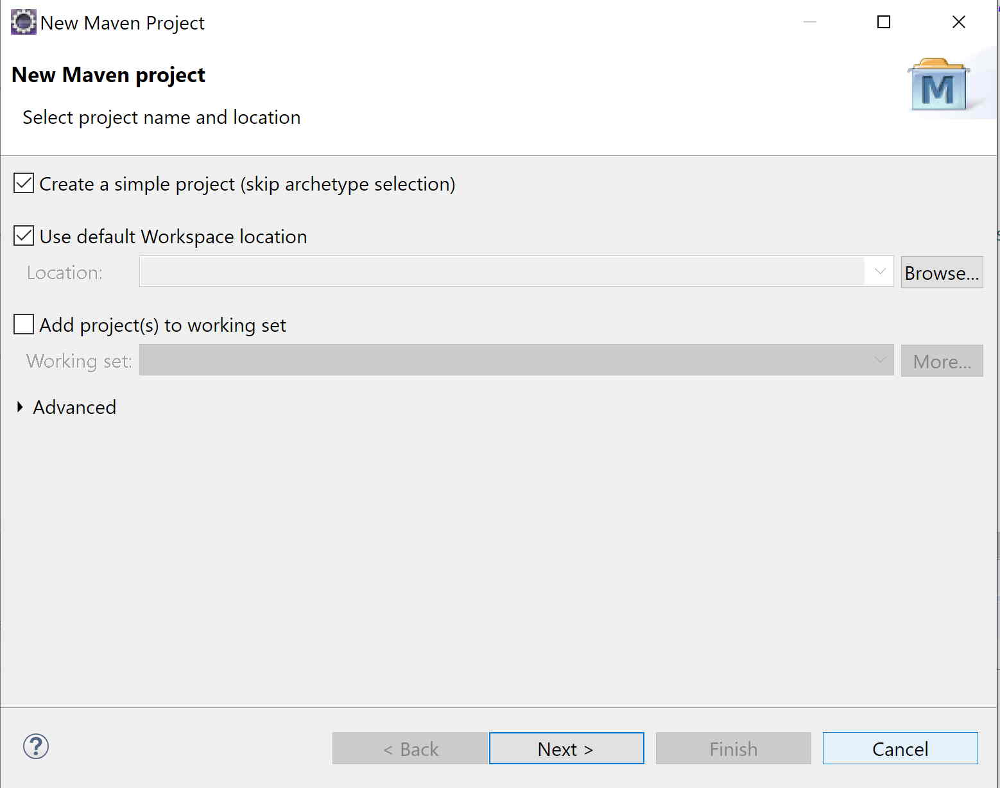
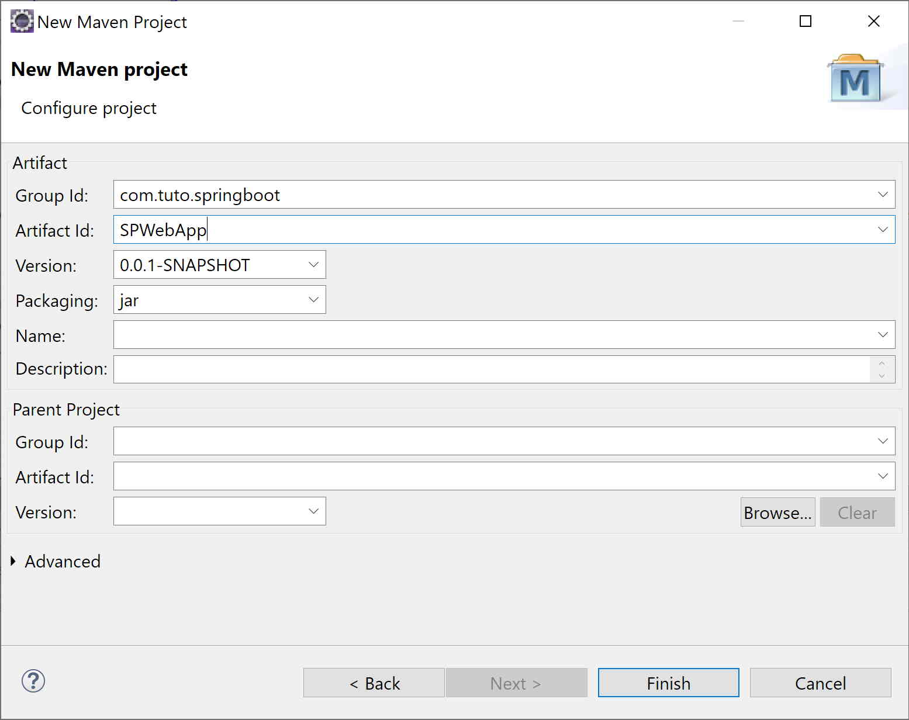
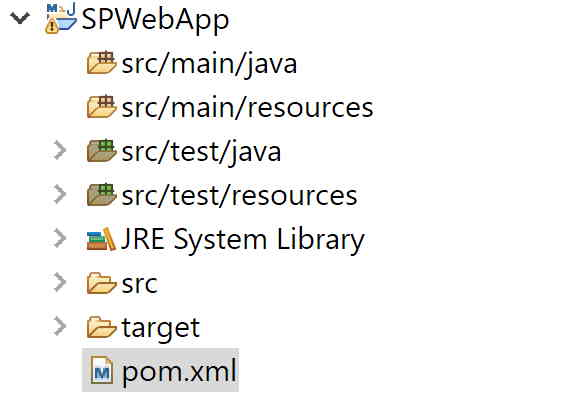
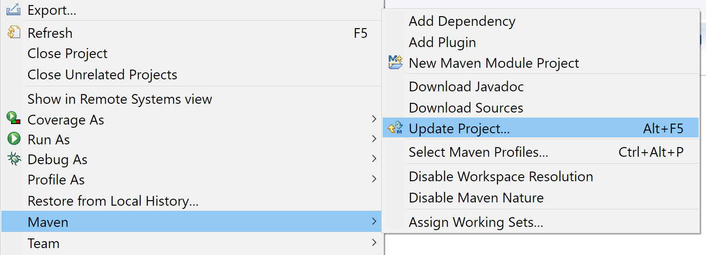

# Step 0: Création d'un projet Maven pour Springboot

## 1 Contexte
Springboot est un framework qui permet la création rapide d'applications notamment Web. Springboot utilise le principe "Convention over Configuration", c'est à dire que tout est pré-configuré avec une notation qui suit des conventions permettant la mise en oeuvre rapide d'applications. SpringBoot ne suit pas exactement les spécifications JEE, mais offre une mise en oeuvre beaucoup plus rapide et légère. Springboot offre aussi la possibilité d'intégrer un server http à l'archive générée permettant à notre application d'être totalement autonome.

## 2 Création à l'aide d'Eclipse

### 2.1 Créer un nouveau projet Maven
- File -> New -> Maven Project
- Sélectionner ```create a simple project (skip artefact selection) ```
  


- Cliquer sur ```Next```
- Définir les propriétés de votre projet Maven:
  - ```GroupeId```: com.tuto.springboot
  - ```ArtefactId```: SPWebApp
  - ```Packaging```: jar



- Cliquer sur finish
- Le projet avec l'aborescence suivant a été créé 



- Explications:
  - les projets Mavens possèdent une structure par défaut permettant de déterminer ou se trouve les fichiers à compiler , les ressources complémentaires, les fichiers de tests...
  - ```src/main/java``` : contiendra les fichiers .java de votre application organisés en package
  - ```src/main/resources``` : contiendra toutes les ressources complémentaires à votre projet (e.g fichiers de configuration..)
  - ```test/main/java``` : contiendra tous les fichiers .java pour tester votre application
  - ```test/main/resources``` : contiendra toutes les ressources complémentaires pour tester votre projet
  - ```pom.xml``` : est le fichier de description Maven qui contient l'ensemble des indications sur votre application, compilation, cycle de vie, dépendances... C'est le fichier central d'une application gérée par Maven.

    ```xml
    <project 
        xmlns="http://maven.apache.org/POM/4.0.0" 
        xmlns:xsi="http://www.w3.org/2001/XMLSchema-instance" 
        xsi:schemaLocation="http://maven.apache.org/POM/4.0.0 http://maven.apache.org/xsd/maven-4.0.0.xsd">
        
    <modelVersion>4.0.0</modelVersion>
    <groupId>com.tuto.springboot</groupId>
    <artifactId>SPWebApp</artifactId>
    <version>0.0.1-SNAPSHOT</version>
    
    </project>
    ```
    - On retrouve pour l'instant dans ce fichier uniquement les informations renseignées lors de la création du projet Maven.


### 2.2 Ajout des outils Springboot
- Afin de pouvoir utiliser le Framework Springboot nous allons devoir récupérer des outils, des libraires Springboot qui vont nous permettre de créer une application Springboot. Pour cela nous allons modifier le fichier de configuration ```pom.xml``` comme suit:

```xml
<project xmlns="http://maven.apache.org/POM/4.0.0"
	xmlns:xsi="http://www.w3.org/2001/XMLSchema-instance"
	xsi:schemaLocation="http://maven.apache.org/POM/4.0.0 http://maven.apache.org/xsd/maven-4.0.0.xsd">

	<modelVersion>4.0.0</modelVersion>
	<groupId>com.tuto.springboot</groupId>
	<artifactId>SPWebApp</artifactId>
	<version>0.0.1-SNAPSHOT</version>
	<packaging>jar</packaging>
	
	<parent>
		<groupId>org.springframework.boot</groupId>
		<artifactId>spring-boot-starter-parent</artifactId>
		<version>2.1.7.RELEASE</version>
		<relativePath /> <!-- lookup parent from repository -->
	</parent>
	
	<name>SPWebApp</name>
	<description>Project Sample for using Springboot</description>

	<properties>
		<java.version>1.8</java.version>
	</properties>

	<dependencies>

		<dependency>
			<groupId>org.springframework.boot</groupId>
			<artifactId>spring-boot-starter-data-jpa</artifactId>
		</dependency>

		<dependency>
			<groupId>org.springframework.boot</groupId>
			<artifactId>spring-boot-starter-web</artifactId>
		</dependency>
		<dependency>
			<groupId>com.h2database</groupId>
			<artifactId>h2</artifactId>
			<scope>runtime</scope>
		</dependency>

		<dependency>
			<groupId>org.springframework.boot</groupId>
			<artifactId>spring-boot-starter-tomcat</artifactId>
			<scope>provided</scope>
		</dependency>
		<dependency>
			<groupId>org.springframework.boot</groupId>
			<artifactId>spring-boot-starter-test</artifactId>
			<scope>test</scope>
		</dependency>
	</dependencies>

	<build>
		<plugins>
			<plugin>
				<groupId>org.springframework.boot</groupId>
				<artifactId>spring-boot-maven-plugin</artifactId>
			</plugin>
		</plugins>
	</build>

</project>
```
- Explications:
    ```xml
    ...
    <parent>
		<groupId>org.springframework.boot</groupId>
		<artifactId>spring-boot-starter-parent</artifactId>
		<version>2.1.7.RELEASE</version>
		<relativePath /> <!-- lookup parent from repository -->
	</parent>
    ...
    ```
    - Notre projet va hériter des propriétés d'un autre projet. Nous allons construire ainsi notre projet Springboot à partir d'un modèle d'application. La balise ```<parent>``` permet d'indiquer un projet Maven parent duquel nous allons hériter toutes les propriétés et dépendances.

    ```xml
    ...	
    <properties>
        <java.version>1.8</java.version>
    </properties>
    ...
    ```
    - La balise ```<properties>``` permet d'indiquer des propriétés supplémentaires à notre projet. Ici nous souhaitons que notre application soit compilée à l'aide de java 1.8

    ```xml
    ...	
	<dependencies>

        <dependency>
			<groupId>org.springframework.boot</groupId>
			<artifactId>spring-boot-starter-web</artifactId>
		</dependency>
        ...
		
	</dependencies>
        ...
    ```
    - Les balises ```<dependencies>```  et ```<dependency>``` permettent de définir les librairies à ajouter à notre projet en dépendances. Toutes ces librairies sont des projets Maven qui vont être téléchargées en local sur notre machine depuis des repo. extérieurs (e.g Maven Repository https://mvnrepository.com/repos/central). Ces libraires (e.g *.jar) sont stockées en général dans un répertoire ```.m2``` à la racine du dossier personnel de l'utilisateur.
    - Il est possible de préciser les versions des libraires que l'on souhaite utiliser en utilisant la balise ```<version>```à l'intérieur de ```<dependency>```.
    - Ici on ajoute l'ensemble des dépendances que nous allons utiliser par la suite:
      - ```spring-boot-starter-web```: Ensemble d'outils pour la création d'applications Web (Restful, Spring MVC,...)
      - ```spring-boot-starter-data-jpa``` : Utilitaire permettant de mapper les classes java en éléments d'une base de données et de gérer la persistance avec la base de données (Spring Data JPA with Hibernate)
      - ```h2``` : Connecteur vers une base de données (ici H2 est une base de données embarquées https://www.h2database.com/html/main.html)
      - ```spring-boot-starter-tomcat``` : Serveur tomcat embarqué qui chargera notre application Web.
      - ```spring-boot-starter-test``` : Ensemble d'utilitaires pour tester notre application Web (e.g JUnit, Hamcrest and Mockito )
    ```xml
    ...	
    <build>
		<plugins>
			<plugin>
				<groupId>org.springframework.boot</groupId>
				<artifactId>spring-boot-maven-plugin</artifactId>
			</plugin>
		</plugins>
	</build>
    ...	
    ```
    - La balise ```build``` contient l'ensemble des éléments permettant de gérer le cycle de vie de notre application.
    - Ici le plugin ```spring-boot-maven-plugin``` va permettre de compiler et packager notre application suivant les règles indiquées dans ce plugin (https://docs.spring.io/spring-boot/docs/current/maven-plugin/usage.html)
- Une fois le fichier modifié nous allons indiquer à Eclipse que le fichier de configuration Maven a changé et que ces modifications doivent être prises en compte.
  - clic droit sur le projet -> ```Maven``` -> ```Update Projet```



- Votre projet est maintenant prêt pour utiliser Springboot

### 2.3 Création d'un application vide Springboot
- Dans ```src/main/java``` ajouter le package ```com.sp```
- Dans les packages ```com.sp```, ajouter ```SpAppHero.java``` comme suit:

```java
package com.sp;

import org.springframework.boot.SpringApplication;
import org.springframework.boot.autoconfigure.SpringBootApplication;

@SpringBootApplication
public class SpAppHero {
	
	public static void main(String[] args) {
		SpringApplication.run(SpAppHero.class,args);
	}
}
```
- Explications
    ```java 
    ...
    @SpringBootApplication
    ...
    ```
    - Permet l'activation  (détail ici https://docs.spring.io/spring-boot/docs/2.1.14.BUILD-SNAPSHOT/reference/html/using-boot-using-springbootapplication-annotation.html):
      - de la configuration automatique de Springboot
      - du scanne des fichiers du package courant pour trouver des annotations spécifiques (e.g @component, @service,...)
      - de l'import de configurations additionnelles au besoin
    ```java 
    ...
   public static void main(String[] args) {
		SpringApplication.run(SpAppHero.class,args);
	}
    ...
    ```
    - Permet de lancer l'application Springboot (https://docs.spring.io/spring-boot/docs/current/api/org/springframework/boot/SpringApplication.html)

- Lancer votre application Springboot clic droit sur le fichier ```SpAppHero.java``` -> ```Run As``` -> ```Java Application```
- Votre application Springboot démarre. Le résultat suivant devrait apparaître dans la console de votre application:
```

  .   ____          _            __ _ _
 /\\ / ___'_ __ _ _(_)_ __  __ _ \ \ \ \
( ( )\___ | '_ | '_| | '_ \/ _` | \ \ \ \
 \\/  ___)| |_)| | | | | || (_| |  ) ) ) )
  '  |____| .__|_| |_|_| |_\__, | / / / /
 =========|_|==============|___/=/_/_/_/
 :: Spring Boot ::        (v2.1.7.RELEASE)

2020-04-21 10:13:41.302  INFO 17840 --- [           main] com.sp.SpAppHero                         : Starting SpAppHero on LAPTOP with PID 17840 
...
...
...
2020-04-21 10:13:46.313  INFO 17840 --- [           main] o.s.b.w.embedded.tomcat.TomcatWebServer  : Tomcat started on port(s): 8080 (http) with context path ''
2020-04-21 10:13:46.317  INFO 17840 --- [           main] com.sp.SpAppHero                         : Started SpAppHero in 5.513 seconds (JVM running for 6.114)

```