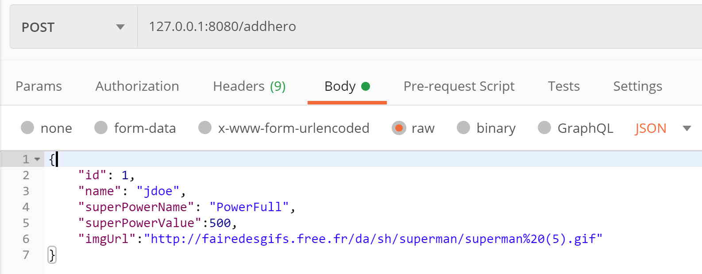
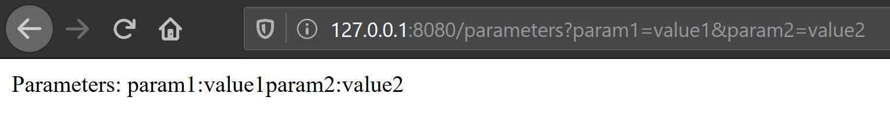
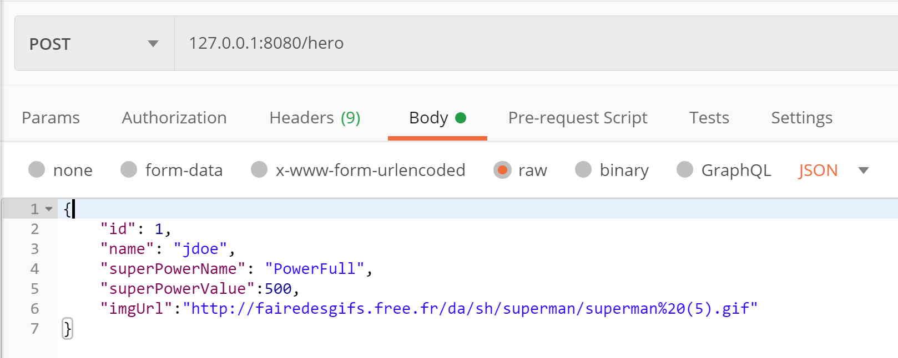
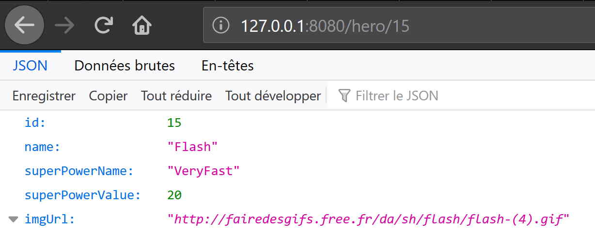
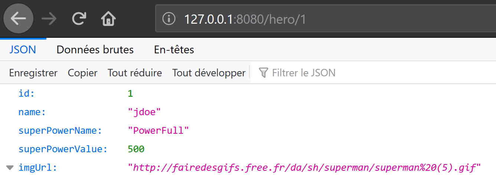

**Author**: Jacques Saraydaryan, All rights reserved
# Step 1: Création d'une application Springboot

## 1 Création de l'application
- Suivre les étapes de la [Step0](../step0/README.md) et créer un projet SpringBoot avec les propriétés suivantes:
  - ```GroupeId```: com.tuto.springboot
  - ```ArtefactId```: SPWebAppStep1
  - ```Packaging```: jar

## 2 Création d'un Contexte REST

### 2.1 Création d'un RestController Simple

#### 2.1.1 Création du RestController 
- Dans ```src/main/java``` ajouter le package ```com.sp```
- Dans les packages ```com.sp``` ajouter ```SpAppHero.java``` comme suit:

```java
package com.sp;

import org.springframework.boot.SpringApplication;
import org.springframework.boot.autoconfigure.SpringBootApplication;

@SpringBootApplication
public class SpAppHero {
	
	public static void main(String[] args) {
		SpringApplication.run(SpAppHero.class,args);
	}
}
```
- Créer un package ```rest``` dans ```com.sp```
- dans ```com.sp.rest``` créer le fichier ```TestRestCrt```

```java
package com.sp.rest;

import org.springframework.web.bind.annotation.RequestMapping;
import org.springframework.web.bind.annotation.RestController;

@RestController
public class TestRestCrt {
	
	@RequestMapping("/hello")
	public String sayHello() {
		return "Hello Hero !!!";
	}

}
```
- Explications:
  - ```@RestController``` : Annotation qui informe SpringBoot que la classe courante pourra déclencher des comportements en fonction d'urls appelées par un Web Browser.
  - ```@RequestMapping("/hello")``` : informe que la fonction ```sayHello``` sera déclenchée lors de l'appel de l'url ```/hello```.

#### 2.1.2 Test du RestController Simple 
- Lancer votre application
  - Clic droit sur le fichier ```SpAppHero```, ```Run AS``` -> ```Java Application```.
- Votre application Springboot démarre. Le résultat suivant devrait apparaître dans la console de votre application:

```
  .   ____          _            __ _ _
 /\\ / ___'_ __ _ _(_)_ __  __ _ \ \ \ \
( ( )\___ | '_ | '_| | '_ \/ _` | \ \ \ \
 \\/  ___)| |_)| | | | | || (_| |  ) ) ) )
  '  |____| .__|_| |_|_| |_\__, | / / / /
 =========|_|==============|___/=/_/_/_/
 :: Spring Boot ::        (v2.5.0)

2020-04-21 14:41:34.774  INFO 18404 --- [           main] com.sp.SpAppHero                         : Starting SpAppHero on LAPTOP-GUASGB11 with PID 18404 (D:\Data\cpe_cours\ASI\ASI-1\addDocs\ws\asi1-springboot-tuto\step1\target\classes started by jsaraydaryan in D:\Data\cpe_cours\ASI\ASI-1\addDocs\ws\asi1-springboot-tuto\step1)
2020-04-21 14:41:34.794  INFO 18404 --- [           main] com.sp.SpAppHero                         : No active profile set, falling back to default ...
...
...
2020-04-21 14:41:47.423  INFO 18404 --- [           main] o.s.b.w.embedded.tomcat.TomcatWebServer  : Tomcat started on port(s): 8080 (http) with context path ''
2020-04-21 14:41:47.459  INFO 18404 --- [           main] com.sp.SpAppHero
```

- Tester le RestController avec l'url suivante:
```
http://127.0.0.1:8080/hello
```
- Vous devez avoir le résultat suivant:
```
Hello Hero !!!
```


### 2.2 Création d'un RestController avancé

#### 2.2.1 Création d'une Classe Modèle
- Créer le package ```com.sp.model```
- Créer le fichier ```Hero.java ``` dans ```com.sp.model``` comme suit:
```java
package com.sp.model;

public class Hero {
	private int id;
	private String name;
	private String superPowerName;
	private int superPowerValue;
	private String imgUrl;
	
	public Hero() {
	}

	public Hero(int id,String name, String superPowerName, int superPowerValue, String imgUrl) {
		super();
		this.id=id;
		this.name = name;
		this.superPowerName = superPowerName;
		this.superPowerValue = superPowerValue;
		this.imgUrl = imgUrl;
	}

	public String getName() {
		return name;
	}

	public void setName(String name) {
		this.name = name;
	}

	public String getSuperPowerName() {
		return superPowerName;
	}

	public void setSuperPowerName(String superPowerName) {
		this.superPowerName = superPowerName;
	}

	public int getSuperPowerValue() {
		return superPowerValue;
	}

	public void setSuperPowerValue(int superPowerValue) {
		this.superPowerValue = superPowerValue;
	}

	public String getImgUrl() {
		return imgUrl;
	}

	public void setImgUrl(String imgUrl) {
		this.imgUrl = imgUrl;
	}
	
	public int getId() {
		return id;
	}

	public void setId(int id) {
		this.id = id;
	}

	@Override
	public String toString() {
		return "HERO ["+this.id+"]: name:"+this.name+", superPowerName:"+this.superPowerName+", superPowerValue:"+this.superPowerValue+" imgUrl:"+this.imgUrl;
	}
}

```

#### 2.2.2 Modification du Rest Controller 
- Modifier le fichier ```TestRestCrt.java``` comme suit:

```java
package com.sp.rest;

import org.springframework.web.bind.annotation.PathVariable;
import org.springframework.web.bind.annotation.RequestBody;
import org.springframework.web.bind.annotation.RequestMapping;
import org.springframework.web.bind.annotation.RequestMethod;
import org.springframework.web.bind.annotation.RequestParam;
import org.springframework.web.bind.annotation.RestController;

import com.sp.model.Hero;


@RestController
public class TestRestCrt {
	
	@RequestMapping("/hello")
	public String sayHello() {
		return "Hello Hero !!!";
	}
	
	@RequestMapping(method=RequestMethod.POST,value="/addhero")
	public void addHero(@RequestBody Hero hero) {
		System.out.println(hero);
	}
	
	@RequestMapping(method=RequestMethod.GET,value="/msg/{id1}/{id2}")
	public String getMsg(@PathVariable String id1, @PathVariable String id2) {
		String msg1=id1;
		String msg2=id2;
		return "Composed Message: msg1:"+msg1+"msg2:"+msg2;
	}
	
	@RequestMapping(method=RequestMethod.GET,value="/parameters")
	public String getInfoParam(@RequestParam String param1,@RequestParam String param2) {
		return "Parameters: param1:"+param1+"param2:"+param2;
	}
}

```
- Explications:
    ```java
    ...
    @RequestMapping(method=RequestMethod.POST,value="/addhero")
	public void addHero(@RequestBody Hero hero) {
		System.out.println(hero);
	}
    ...
    ```
    - ```method=RequestMethod.POST``` : définit la méthode HTTP autorisée sur cette URL.
    - ```value="/hero"``` : définit l'URL qui déclenchera la fonction
    - ```@RequestBody Hero hero ``` : permet de rechercher le contenu du body de la requête HTTP et le convertit en objet java

    ```java
    ...
    	@RequestMapping(method=RequestMethod.GET,value="/msg/{id1}/{id2}")
	public String getMsg(@PathVariable String id1, @PathVariable String id2) {
		String msg1=id1;
		String msg2=id2;
		return "Composed Message: msg1:"+msg1+"msg2:"+msg2;
	}
    ...
    ```
    - ``` value="/msg/{id1}/{id2}" ``` : définit des variables dans l'URL qui seront définies par l'utilisateur lors de l'envoi de L'URL.
    - ```@PathVariable String id1, @PathVariable String id2``` : récupère les variables de l'URL et les met à disposition de la fonction.
    ```java
    @RequestMapping(method=RequestMethod.GET,value="/parameters")
	public String getInfoParam(@RequestParam String param1,@RequestParam String param2) {
		return "Parameters: param1:"+param1+"param2:"+param2;
	}
    ```
    - ```@RequestParam String param1,@RequestParam String param2``` : permet de récupérer les paramètres associés à la requête HTTP et de les rendre disponible à la fonction associée.

#### 2.2.3 Test de l'application Rest Controller 
- Lancer votre application
  - clic droit sur le fichier ```SpAppHero```, ```Run AS``` -> ```Java Application```.
- Tester:  Création d'un Hero:
  - Création d'un Hero : à l'aide de PostMan envoyer la requête suivante:


  
  - le résultat suivant doit s'afficher dans la console de l'application

    ```
    HERO [1]: name:jdoe, superPowerName:PowerFull, superPowerValue:500 imgUrl:http://fairedesgifs.free.fr/da/sh/superman/superman%20(5).gif
    ```
- Tester:  Variable dans l'URL:
  - Appeler l'Url suivante dans un Web Browser:
    ```
    http://127.0.0.1:8080/msg/myPath1/myPath2
    ```
  - Le résultat obtenu:


- Tester:  Paramètres dans la requête HTTP:
  - Appeler l'Url suivante dans un Web Browser:
    ```
    http://127.0.0.1:8080/parameters?param1=value1&param2=value2
    ```
  - Le résultat obtenu:
  


## 3 Persistance des données et Services
- Springboot offre la possibilité de faire de l'injection de dépendance. Ainsi des instances de classe crées par le serveur pourront être utilisées dans d'autres classes

### 3.1 Service Springboot
- Springboot nous permet de créer des instances uniques de classes (Singleton) qui auront comme responsabilité d'effectuer le traitement métiers de l'application
- Créer le package ```com.sp.service```
- Créer le fichier ```HeroService.java``` dans le package ```com.sp.service``` comme suit:
  ```java
  package com.sp.service;
    import org.springframework.stereotype.Service;

    import com.sp.model.Hero;

    @Service
    public class HeroService {
        
        public void addHero(Hero h) {
            System.out.println(h);
        }
        
        public Hero getHero(int id) {
            Hero h =new Hero(2, "Flash", "VeryFast", 20, "http://fairedesgifs.free.fr/da/sh/flash/flash-(4).gif");
            return h;
        }

    }
    ```

- Explications:
    - ```@Service``` : annotation permettant de créer un singleton de la classe courante et permettant l'injection de dépendances dans une autre classe.


- Créer le fichier ```HeroRestCrt.java``` dans le package ```com.sp.rest``` comme suit:
  ```java
    package com.sp.rest;

    import org.springframework.beans.factory.annotation.Autowired;
    import org.springframework.web.bind.annotation.PathVariable;
    import org.springframework.web.bind.annotation.RequestBody;
    import org.springframework.web.bind.annotation.RequestMapping;
    import org.springframework.web.bind.annotation.RequestMethod;
    import org.springframework.web.bind.annotation.RestController;

    import com.sp.model.Hero;
    import com.sp.service.HeroService;

    @RestController
    public class HeroRestCrt {
        @Autowired
        HeroService hService;
        
        @RequestMapping(method=RequestMethod.POST,value="/hero")
        public void addHero(@RequestBody Hero hero) {
            hService.addHero(hero);
        }
        
        @RequestMapping(method=RequestMethod.GET,value="/hero/{id}")
        public Hero getHero(@PathVariable String id) {
            Hero h=hService.getHero(Integer.valueOf(id));
            return h;
        }
    }
  ```
  - Explications:
    - ```@Autowired``` : annotation permettant d'injecter le service ```HeroService```. Cet object sera utilisé uniquement au moment de son appel (e.g ```hService.addHero(hero);```) 

- Tester votre application:
  - Lancer votre application
    - Clic droit sur le fichier ```SpAppHero```, ```Run AS``` -> ```Java Application```.
- Tester:  add User:
  - A l'aide de Postman, effectuer la requête suivante:



  - le résultat suivant doit s'afficher dans la console de l'application

    ```
    HERO [1]: name:jdoe, superPowerName:PowerFull, superPowerValue:500 imgUrl:http://fairedesgifs.free.fr/da/sh/superman/superman%20(5).gif
    ```
 - Tester:  get User:

  - Appeler l'Url suivante dans un Web Browser:
    ```
    http://127.0.0.1:8080/hero/15
    ```
     - Le résultat obtenu:
  


## 3.2 Persistance de données

### 3.2.1 Entity
- Afin de permettre de sauvegarder ```Hero``` dans la base de données ```H2```. Modifier le fichier ```Hero.java``` comme suit:

```java
package com.sp.model;

import javax.persistence.Entity;
import javax.persistence.GeneratedValue;
import javax.persistence.Id;

@Entity
public class Hero {
	@Id
	@GeneratedValue
	private Integer id;
	private String name;
	private String superPowerName;
	private int superPowerValue;
	private String imgUrl;
	
	public Hero() {
	}

	public Hero(int id,String name, String superPowerName, int superPowerValue, String imgUrl) {
		super();
		this.id=id;
		this.name = name;
		this.superPowerName = superPowerName;
		this.superPowerValue = superPowerValue;
		this.imgUrl = imgUrl;
	}

...
```
- Explications
  - ```@Entity``` nous indique que cette classe est une classe persistante. Le service JPA va ainsi créer une table correspondante à cette classe (la table de la BD portera le nom de la classe par default)
  - ```@Id``` indique à JPA que l'attribut ```private int id``` est la clé primaire de notre table
  - ```@GeneratedValue``` indique à JPA  que l'attribut ```private int id``` sera auto-généré.
  
### 3.2.2 Repository
- Créer le package ```com.sp.repository```
- Créer le fichier ```HeroRepository.java``` dans ```com.sp.repository``` comme suit:
```java
package com.sp.repository;

import java.util.List;
import org.springframework.data.repository.CrudRepository;
import com.sp.model.Hero;

public interface HeroRepository extends CrudRepository<Hero, Integer> {

	public List<Hero> findByName(String name);
}
```
- Explications:
    ```java
    ...
    public interface HeroRepository extends CrudRepository<Hero, Integer> {
    ...
    ```
    - Springboot nous permet de créer un DAO (Data Access Object) automatiquement à partir de l'interface présentée ici. Cette interface précise que le futur DAO sera un CRUD (Create Read Update Delete) et portera sur l'objet ```Hero```qui a pour clé un ```Integer```. Springboot va alors se charger de créer un singleton DAO à partir de ce fichier avec les méthodes permettant d'ajouter, de mettre à jour, d'accéder et de supprimer des objets ```Hero```.
    
    ```java
    ...
    public List<Hero> findByName(String name);
    ...
    ```
    - Ici on définit une méthode grace à une convention de nommmage ```findBy<attributeName>```. Springboot va alors créer une méthode associée qui effectuera une requête (e.g sql) permettant de récupérer tous les ```Hero``` qui possèdent le ```name``` égal au ```name``` passé en paramètre.

### 3.2.3 Modification du service
- Modifier le fichier ```HeroService``` comme suit:

```java
package com.sp.service;

import java.util.Optional;

import org.springframework.beans.factory.annotation.Autowired;
import org.springframework.stereotype.Service;

import com.sp.model.Hero;
import com.sp.repository.HeroRepository;

@Service
public class HeroService {
	@Autowired
	HeroRepository hRepository;
	public void addHero(Hero h) {
		Hero createdHero=hRepository.save(h);
		System.out.println(createdHero);
	}
	
	public Hero getHero(int id) {
		Optional<Hero> hOpt =hRepository.findById(id);
		if (hOpt.isPresent()) {
			return hOpt.get();
		}else {
			return null;
		}
	}

}
```
- Explications:
    ```java
    ...
    @Autowired
	HeroRepository hRepository;
    ...
    ```
    - Permet d'injecter l'objet ```HeroRepository``` créé par Springboot

    ```java
    ...
    hRepository.save(h);
	...
    Optional<Hero> hOpt =hRepository.findById(id);
    ...
    ```
    - ```HeroRepository``` possède des méthodes prédéfinies lui permettant de jouer son rôle de CRUD.

### 3.2.4 Test de l'application
- Tester votre application:
  - Lancer votre application
    - Clic droit sur le fichier ```SpAppHero```, ```Run AS``` -> ```Java Application```.

  - A l'aide de Postman, effecuter la requête suivante:


  - Dans un WebBrowser appeler ensuite l'URL suivante avec l'id qui s'affiche dans la console de l'application:
```
127.0.0.1:8080/hero/1
```
 - Le résultat obtenu doit être le suivant:


  

# 4 Changer la configuration par default du serveur Springboot
- Dans ```src/main/resources``` créer le fichier ```application.properties```
```yaml
server.address=127.0.0.1
server.port=8081

## FOR EXTERNAL MYSQL DB
#spring.jpa.hibernate.ddl-auto = validate
#spring.jpa.hibernate.ddl-auto=create
#spring.datasource.url=jdbc:mysql://127.0.0.1:3306/bd

## PostgreSQL
#spring.datasource.url=jdbc:postgresql://127.0.0.1:5432/bd
#spring.datasource.username=mylogin
#spring.datasource.password=mypwd


## FOR EMBEDED DB
spring.jpa.hibernate.ddl-auto=create

```
- Explications:
  - ```server.address=127.0.0.1``` : permet de rédéfinir l'adresse de notre serveur
  - ``` server.port=8081 ``` : permet de rédéfinir le port de notre serveur
  - ```spring.jpa.hibernate.ddl-auto=create``` : permet de définir le comportement de notre application. Ici ```create``` indique à JPA que la base de données sera reconstruite à chaque démarrage de l'application (perte de données à chaque redémarrage). ```validate``` permet d'utiliser une base de données déjà créée.

- Usage d'une base de données extérieure
  - Dans le cas ou vous souhaitez utiliser une base de données extérieure (e.g Postgresql) vous devez
    - Ajouter la dépendance du connecteur JDBC au pom.xml et commenter les connecteurs non utilisés.

    ```xml
    ...
        <!-- <dependency> -->
		<!-- <groupId>com.h2database</groupId> -->
		<!-- <artifactId>h2</artifactId> -->
		<!-- <scope>runtime</scope> -->
		<!-- </dependency> -->

		<dependency>
		<groupId>org.postgresql</groupId>
		<artifactId>postgresql</artifactId>
		</dependency>
    ...
    ```
    - Modifier le fichier ```application.properties``` pour renseigner les propriétés de la base de données cible

    ```yaml
        server.address=127.0.0.1
        server.port=8080

        ## PostgreSQL
        spring.jpa.hibernate.ddl-auto=create
        spring.datasource.url=jdbc:postgresql://127.0.0.1:5432/bd
        spring.datasource.username=mylogin
        spring.datasource.password=mypwd

    ```


