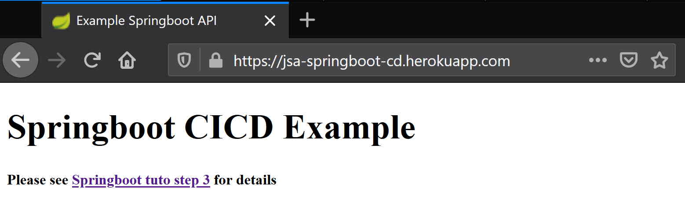

**Author**: Jacques Saraydaryan, All rights reserved
# Step 3: CI/CD pour une application SpringBoot
Note tout le contenu de cette partie est disponible ici (https://gitlab.com/js-as1/asi1-springboot-cicd-example)

## 1 Contexte
Afin d'automatiser la mise en oeuvre de tests et la compilation de l'application, nous allons mettre en place sur chaîne d'intégration continue et de déploiement continue pour notre application Springboot.
Git lab propose un gamme d'outils permettant la mise en place de processus automatiques pour l'intégration continue (e.g vérification de la syntaxe, exécution de tests unitaires, création de livrable...).

Une complète présentation de la CI/CD de Gitlab est disponible ici [https://docs.gitlab.com/ee/ci/](https://docs.gitlab.com/ee/ci/). 

*Workflow Gitlab CI-CD*

Pour mettre en place l'intégration continue dans un repository git lab, il suffit d'ajouter un fichier ```.gitlab-ci.yml``` à la racine du répository.
Ce fichier va permettre de configurer tout le process automatique d'intégration continue.

## 2 Présentation de  ```.gitlab-ci.yml```

```.gitlab-ci.yml``` contient l'ensemble des instructions permettant la mise en oeuvre de pipeline d'intégration continue. Un ```pipeline``` est une suite d'opérations (```jobs```) qui va être réalisée automatiquement dès qu'un déclencheur est activé (e.g push sur la branch DEV, MASTER). Ces ```jobs``` peuvent être exécutés en parallèle et regroupés en ```stage``` (étapes regroupant plusieurs ```jobs```). Une complète présentation des ```pipelines``` et des ```stages``` est disponible ici [https://docs.gitlab.com/ee/ci/pipelines.html](https://docs.gitlab.com/ee/ci/pipelines.html).   


## 3 Création d'un pipeline de compilation
- Ici nous allons créer une intégration continue permettant de compiler automatiquement notre code.

- Créer un fichier ```.gitlab-ci.yml``` à la racine de votre projet comme suit:


```yaml
# image docker (container virtuel) pour executer les jobs (e.g effectuer le build de l'application)
image: "maven:3-jdk-8"

# commandes à executer sur le container virtuel (e.g ajout d'outils non dispo sur l'image de base)
before_script:
  - echo "I am a script executed before"

# definition de l'ordre d'execution des jobs 
# (e.g tous les jobs qui ont 'state:build' seront executés en premiers, puis tous les jobs de 'state:test' etc..)
stages:
  - build

# definition d'un job, à quelle étape il sera executé (stage), le script a executé (e.g mvn compile)
job_build:
  stage: build
  script:
    - mvn compile
    
```
- Explications
  - ```image: "maven:3-jdk-8"``` permet de préciser quelle image docker sera utilisée pour exécuter les différents jobs. Note il est possible de spécifier des images spécifiques par jobs également. Ici l'image docker utiliser contiendra maven et un jdk-8.
  ```yaml
  ...
  before_script:
  - echo "I am a script executed before"
  ...
  ```
  - Permet d'exécuter des scripts sur le container docker qui sera utilisé avant la réalisation des jobs (e.g sudo apt-get install nano)

  ```yaml
  ...
  stages:
  - build
  ...
  ```
  - Définit les étapes à réaliser dans ce pipeline. ici l'étape ```build``` sera exécutée en première. Note le nom de chaque étape est libre.

  ```yaml
  job_build:
  stage: build
  script:
    - mvn compile
  ```
  - Précise un job. Ici ce job ```job_build```, sera exécuté à l'étape indiquée par ```stage```. Dans notre cas, le job ```job_build``` s'exécutera à l'étape ```build```. ```script``` permet de préciser l'ensemble des commandes à exécuter durant cette étape. Ici nous allons lancer la commande de compilation d'un projet maven ``` mvn compile ```

- Commiter votre modification et regarder le résultat de CI/CD dans l'interface web de gitlab.


## 4 Ajout d'une étape d'exécution de tests automatiques
- Modifier le fichier ```.gitlab-ci.yml``` comme suit:

```yaml
...
stages:
  - build
  - test
...
# definition un nouveau job
job_test:
  stage: test
  script:
    - mvn test
...
```
- Explications:
  ```yaml
  ...
  stages:
    - build
    - test
  ...
  ```
  - Ajout d'une étape ```test``` à notre pipeline
  ```yaml
  ...
  job_test:
  stage: test
  script:
    - mvn test
  ...
  ```
  - création d'un nouveau job ```job_test``` qui s'exécutera à l'étape ```test```.

- Commiter votre modification et regarder le résultat de CI/CD dans l'interface web de gitlab.

## 5 Ajout d'une étape de package et récupération de la version compilée
- Modifier le fichier ```.gitlab-ci.yml``` comme suit:
```yaml
...
stages:
  - build
  - test
  - package
...
# definition un nouveau job
job_package:
  stage: package
  script:
    - mvn package
  artifacts:
    paths:
    - target/*.jar
    expire_in: 1 week
```
- Explications:
  ```yaml
  ...
  stages:
    - build
    - test
    - package
  ...
  ```
  - Ajout d'une étape ```package``` à notre pipeline
  ```yaml
  ...
  job_package:
    stage: package
    script:
      - mvn package
    artifacts:
      paths:
      - target/*.jar
      expire_in: 1 week
  ...
  ```
  - Création d'un nouveau job ```job_package``` qui s'exécutera à l'étape ```package```. Ici l'élément ```artifacts``` permet de préciser les objets à récupérer et à rendre disponible au téléchargement sur l'interface web de Gitlab. ```paths``` indique les éléments à récupérer en utilisant les expréssions régulières. Ici tous les fichiers ```.jar``` du répertoire ```targert``` seront récupérés. La balise ```expire_in``` détermine au bout de combien de temps les fichiers vont être disponibles au téléchargement sur l'interface web de Gitlab.


## 6 Mise en place du déploiement continu
- Le déploiement continu va permettre de mettre en place sur un serveur la dernière version de notre application. Pour cela nous allons utiliser les serveurs d'```Heroku```.

La suite de ce tuto suit les recommandations indiquées ici (https://medium.com/swlh/how-do-i-deploy-my-code-to-heroku-using-gitlab-ci-cd-6a232b6be2e4)

### 6.1  Configurer de Heroku

- Créer un compte chez HEROKU https://dashboard.heroku.com/
- Générer une clé d'API dans ```account settings```> ```Real```


- Créer une nouvelle application 


### 6.2 Configurer de Gilab
- Dans votre projet Gilab ouvir le menu ```settings > CI/CD```
- Vérifier que les ```runner``` Gitlab sont activés


- Aller dans la section ```Variables``` et ajouter les 3 variables suivantes:
  - HEROKU_API_KEY : clé de votre Api Heroku
  - HEROKU_APP_PRODUCTION : nom de votre app en stage
  - HEROKU_APP_STAGING : nom de votre app en prod


### 6.3 Modification du pipeline
- A la racine de votre projet Gitlab, modifier le fichier ```.gitlab-ci.yml``` comme suit:

```yaml
...
stages:
  - build
  - test
  - package
  - deploy

...

# definition un nouveau job pour le déploiement continu
job_deploy:
  stage: deploy
  image: ruby:2.4
  script:
    - apt-get update -qy
    - apt-get install -y ruby-dev
    - gem install dpl
    - dpl --provider=heroku --app=$HEROKU_APP_PRODUCTION --api-key=$HEROKU_API_KEY
    
  only:
    - master
```
- Explications
  ```yaml
  ...
  stages:
    - build
    - test
    - package
    - deploy
  ...
  ```
  - Ajout d'une étape ```deploy``` à notre pipeline
  ```yaml
  ...
  job_deploy:
    stage: deploy
    image: ruby:2.4
    script:
      - apt-get update -qy
      - apt-get install -y ruby-dev
      - gem install dpl
      - dpl --provider=heroku --app=$HEROKU_APP_PRODUCTION --api-key=$HEROKU_API_KEY
      
    only:
      - master
  ...
  ```
    - Création d'un nouveau job ```job_deploy``` qui s'exécutera à l'étape ```deploy```. Ici la balise ```script``` définit l'ensemble des scripts a exécutés lors de cette étape. Les outils nécessaires au déploiement seront installés puis la commande ``` dpl --provider=heroku --app=$HEROKU_APP_PRODUCTION ``` permet de déployer notre application sur les serveurs distants d'Heroku.
    - ```only``` spécifie sur quel branche le job sera autorisé. Dans notre cas, le job ```job_deploy``` sera exécuté uniquement sur la branche master.


### 6.4 Fichier complet final ```.gitlab-ci.yml```

```yaml
# image docker (container virtuel) pour executer les jobs (e.g effectuer le build de l'application)
image: "maven:3-jdk-8"

# commandes à executer sur le container virtuel (e.g ajout d'outils non dispo sur l'image de base)
before_script:
  - echo "I am a script executed before"

# definition de l'ordre d'execution des jobs 
# (e.g tous les jobs qui ont 'state:build' seront executés en premiers, puis tous les jobs de 'state:test' etc..)
stages:
  - build
  - test
  - package
  - deploy

# definition d'un job, à quelle étape il sera executé (stage), le script a executé (e.g mvn compile)
job_build:
  stage: build
  script:
   - mvn compile
    
# definition un nouveau job
job_test:
  stage: test
  script:
    - mvn test

# definition un nouveau job
job_package:
  stage: package
  script:
    - mvn package
  # definition d'un livrable issue de la compilation (et des autres opérations demandées), disponible au téléchargement
  artifacts:
    paths:
    - ./target/*.jar
    expire_in: 1 week

# definition un nouveau job pour le déploiement continu, ici heroku va détecter automatiquement le type de projet
# (grave au pom.xml à la racine) et lancer l'application au démarrage
job_deploy:
  stage: deploy
  image: ruby:2.4
  script:
    - apt-get update -qy
    - apt-get install -y ruby-dev
    - gem install dpl
    - dpl --provider=heroku --app=$HEROKU_APP_PRODUCTION --api-key=$HEROKU_API_KEY
  only:
    - master
```

### 6.5 Test du déploiement
- Commiter et pusher vos changements sur la branche master
- Vérifier que les étapes du déploiement ont bien été réalisées.


- Vérifier sur le lien Heroku de votre application que votre version commiter sur master a bien été déployée sur votre instance Heroku 


